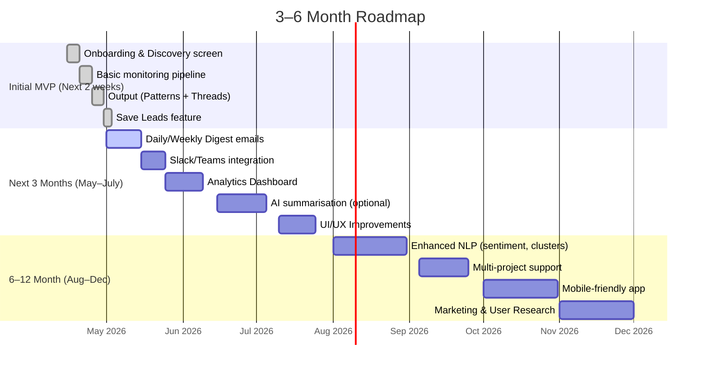

# Executive Summary  
RedShip is a SaaS tool that **“monitors Reddit to find potential customers”** for SaaS businesses【17†L59-L66】. It auto-generates keywords from a user’s website, then continually scans Reddit (via Google-ranking (“SEO”) threads, live new posts, and comment mentions) for relevant discussions【42†L51-L55】【18†L64-L72】. Every matching post is scored (0–100) for relevance【7†L178-L180】【42†L51-L55】 and the top opportunities are delivered in a daily inbox (with Slack/email notifications) for outreach【7†L182-L190】【42†L51-L55】. RedShip’s target users are SaaS founders and marketers who want **inbound Reddit leads and content-SEO value** (e.g. commenting on high-traffic threads)【42†L43-L49】【33†L154-L160】. Key features include AI-powered scoring, real-time alerts, an SEO opportunity finder, and AI reply suggestions【7†L178-L186】【42†L57-L61】. 

By contrast, our proposed MVP is *monitoring-first* with an emphasis on **pain-point analysis**. Its focus is to continuously detect and surface *patterns of problems* (e.g. repeated complaints) in Reddit threads over time, rather than primarily providing individual lead threads. In practice, the MVP will onboard with an initial “discovery” search (similar to RedShip’s setup), then transition to background monitoring that highlights both (a) recurring issues or complaints (“patterns”), and (b) immediate engagement opportunities (“opportunities”). This differs from RedShip’s “daily inbox” approach by separating high-level insights (patterns) from specific threads, and by saving leads for follow-up.  

This report analyses RedShip’s workflow, features and feedback; maps its capabilities against our MVP’s requirements; and then specifies the recommended MVP design (value proposition, outputs, data model, tech needs, retention hooks). It also outlines the user flow and UI designs (with annotated wireframes and a ship-it checklist), a 3–6 month roadmap, and an assessment of risks (scraping, rate limits, Reddit TOS) with mitigations. 

## 1. RedShip: Competitive Analysis

### How RedShip Works (Core Workflow)  
- **Onboarding:** Users enter their website or product URL. RedShip “analyzes your website to understand your product and generate the best keywords”【7†L144-L153】. This sets up the monitoring scope automatically (RedShip uses the site content to infer keywords).  
- **Discovery & Processing:** Once configured, RedShip begins three types of Reddit searches【18†L61-L70】:  
  - **SEO Search (daily):** Every morning, RedShip scans Reddit for posts matching the keywords *and* checking which ones rank on Google. High-ranking threads yield long-term visibility (“evergreen discussions”)【18†L64-L72】.  
  - **Realtime Search (continuous):** RedShip tracks specified subreddits (and keywords) in real-time, catching new posts within minutes of publication【18†L83-L92】. Each incoming post is AI-scored for relevance【7†L178-L180】【18†L90-L98】, and top posts trigger alerts.  
  - **Mentions Search (continuous):** It also scans Reddit *comments* for keyword mentions (e.g. “looking for X” in a comment thread), surfacing hidden opportunities【18†L101-L110】.  
- **Output:** The user receives a **daily inbox/digest** (via email/Slack/webhook) of the *highest-scoring threads*, along with automated “reply drafts” if enabled【7†L182-L190】【42†L57-L61】. RedShip’s UI also offers bookmarking/saving posts and tracking which subreddits perform best【7†L202-L204】【42†L57-L61】. 

【42†L51-L55】【18†L72-L80】 *Figure: Example RedShip workflow. Users add a site, RedShip auto-generates keywords and continuously searches Reddit (SEO, new posts, comments). Top posts are scored (0–100) and delivered in a “Daily Inbox” for the user to engage.*  

The **core value proposition** is “turn Reddit users into customers” by finding *inbound* conversations where people describe problems your product solves【42†L43-L49】. RedShip prioritizes “pain-driven questions”, recommendation requests, and early-stage decision threads (rather than just competitor mentions)【33†L99-L102】【33†L114-L122】. In effect, it identifies where users **explicitly or implicitly express pain points** related to the user’s niche.  

### Key Features and UI/UX  
RedShip’s interface is designed as a *lead-generation toolkit*. Key elements (and illustrative citations) include:  
- **AI-Powered Scoring:** Every post is scored 0–100 for relevance to your product【7†L178-L180】【42†L51-L55】. This helps filter out noise.  
- **Daily Inbox:** The user “wakes up to fresh opportunities delivered every morning”【7†L182-L184】. This digest lists top threads (with metadata like subreddit, title).  
- **Real-Time Alerts:** New high-relevance posts are caught *within minutes*【7†L188-L190】【42†L57-L61】. The UI shows “x new posts detected” in realtime.  
- **SEO Opportunity Finder:** RedShip highlights Reddit threads already ranking on Google for your keywords【22†L0-L4】【42†L57-L61】. Engaging these drives organic traffic.  
- **Comment Monitoring:** In addition to posts, it monitors comment threads for relevant discussions【7†L235-L243】【42†L57-L61】.  
- **Notifications & Integrations:** Alerts are delivered via Email, Slack, or Webhooks【7†L219-L227】【42†L57-L61】.  
- **Reply Assistance:** The platform can generate AI-based reply drafts tailored to each conversation【7†L198-L201】【42†L91-L96】. Users can click-to-reply or save posts for later.  
- **Save & Organize:** Users can bookmark or label posts to track “best opportunities”【7†L202-L204】. RedShip also provides basic analytics (e.g. which subreddits yield most leads).  

The UI is **modern and streamlined**. The landing/dashboard (as seen in screenshots) prominently shows a daily inbox of “best posts” and a sidebar for navigation. The “Add website” onboarding screen has a simple form (see Figure 1). The product demo and FAQs emphasise minimal clicks: add your site, wait for results, engage directly on Reddit. Overall, RedShip’s UX is praised for fast setup and “laser-focused” results【7†L317-L320】. The emphasis is on *actionable alerts*, not raw data: users “process a daily list of relevant posts and then comment or DM when appropriate”【33†L134-L142】【33†L154-L160】.  

### Pricing & Plans  
RedShip offers three paid tiers (monthly billing, with a 3-day free trial)【3†L338-L346】【42†L14-L18】:  

| Plan         | Starter (US$19)        | Growth (US$39)           | Professional (US$89)         |
|--------------|------------------------|--------------------------|------------------------------|
| **Tracked websites** | 1                      | 3                        | Unlimited                    |
| **Keywords**         | 10                     | 30                       | 80                           |
| **Reddit Monitoring**| Live real-time        | Live real-time           | Live real-time               |
| **SEO alerts**       | Weekly opportunities  | Weekly opportunities     | Weekly opportunities         |
| **Notifications**    | Email, Slack          | Email, Slack, Webhook    | Email, Slack, Webhook        |
| **AI replies**       | Unlimited            | Unlimited               | Unlimited                    |
| **Auto-DMs**         | 30/day (coming soon) | 100/day (coming soon)   | 300/day (coming soon)        |

*(Features per plan summary compiled from RedShip pricing page【3†L340-L348】【3†L373-L381】 and comparison sites【42†L14-L18】.)*  

Notably, **keyword caps** are relatively low (only 10 in Starter), so many users will upgrade. All plans include the key features above. RedShip also positions *auto-DM outreach* on the roadmap (though this is not yet live)【42†L62-L65】. 

### Target Users  
RedShip explicitly targets **startup founders, indie-hackers, and marketing teams** who need to “find customers on Reddit”【7†L317-L320】【33†L154-L160】. Its core promise is high for B2B/SaaS companies: Reddit communities often have technical buyers and early adopters. The user testimonials highlight that RedShip is “instantly useful from day one” for Reddit marketing【7†L317-L320】. The founder’s own story (Reaching 500 users in 83 days【26†L98-L107】) suggests it appeals to bootstrapped SaaS makers. In short, target users are those who **believe Reddit can be a lead channel** and want a guided, data-driven approach. Less ideal users would be those uninterested in hands-on engagement or small subreddits where search volume is low.  

### Strengths of RedShip  
- **Ease-of-Use:** Automatic keyword generation (from website) and minimal setup means fast “aha moment”【26†L139-L147】. Founder notes that “onboarding is simple, no unnecessary friction, aha moment happens early”【26†L139-L147】. Users just sign up and let RedShip run.  
- **Focused Alerts:** AI scoring and filters mean the user only sees *top opportunities*, not every thread. RedShip’s site claims “stop wasting time on irrelevant posts” with its 0–100 AI relevance score【4†L30-L38】. In practice, reviews note the clean UI and “laser-focused” list of leads【7†L317-L321】.  
- **SEO Value:** The built-in SEO search is a differentiator; it finds threads with existing Google traffic. This can yield long-tail benefits that typical monitoring tools miss.  
- **Multi-Channel Notifications:** Instant alerts via Slack or webhook integrate with workflows (F5Bot comparison notes Slack support【4†L47-L54】).  
- **Founder Expertise:** The product is “built by a founder tired of missing Reddit opportunities”【7†L297-L305】, which suggests strong domain insight. The continuous public updates also indicate active improvement.  

### Weaknesses & User Feedback  
- **Lack of Pain-Pattern Analysis:** RedShip focuses on individual posts; it **does not aggregate recurring complaints** or “pain points” across threads. Users must glean patterns manually. In other words, it surfaces *leads*, not deep insights. (This is a gap our MVP can fill.)  
- **Automation Risk (Auto-DMs):** Although not yet live, the roadmap’s emphasis on automated DMs (30–300/day limits) is controversial. Reppit AI’s review warns that “automated mass DMs are one of the fastest ways to get a Reddit account banned”【42†L14-L18】. This suggests RedShip might push towards automation that runs the risk of user accounts being flagged. This feature is a **potential weakness** in product direction (and will be a serious risk if not managed).  
- **Keyword Limit Caps:** The Starter plan’s 10 keywords is low, limiting discovery. As one analysis noted, “for most SaaS products, 10 keywords barely scratches the surface”【42†L123-L131】. Users may feel forced to upgrade to cover their niche fully.  
- **Generic Engagement Features:** RedShip’s AI reply drafts are useful, but in testing they may not replace genuine human replies. Some users might find them too templated.  
- **Cost:** At $39–89/mo for decent coverage, smaller teams may balk, especially given unknown DM automation risks.  
- **User Feedback:** Public testimonials are largely positive (e.g. “instantly useful… I recommend it without hesitation”【7†L317-L320】). Independent reviews are limited. On Reddit, one comment notes RedShip “filters noise” well. I did not find major negative reviews, but the concern about “shutting down GummySearch” alternatives implies RedShip is the closest existing solution【32†L8-L12】. (We will monitor communities for any criticisms.)  

Overall, RedShip’s user feedback emphasizes **clean UI, fast setup, and effective filtering**【7†L317-L320】【42†L57-L61】. The main *concerns* come from the roadmap (auto-DMs) and pricing. Importantly for us, users **aren’t talking about analytics or pattern insights**, which underlines our MVP’s niche (pain analysis). 

## 2. Feature Comparison: RedShip vs. Proposed MVP  

| **Feature / Capability**          | **RedShip**                                    | **Proposed MVP (Monitoring-first)**                                           |
|-----------------------------------|------------------------------------------------|-------------------------------------------------------------------------------|
| **Onboarding**                    | User adds website/product → auto-keyword gen【7†L144-L153】. Setup is quick. | User inputs niche/product (e.g. URL or keywords) → start initial search (no heavy analysis). |
| **Immediate Discovery Phase**     | (N/A) – RedShip immediately begins monitoring; no separate “discovery” UI. | Yes: run a one-shot discovery search on signup. Show initial threads and pain points. |
| **Monitoring (ongoing)**          | Yes – real-time + daily scanning 24/7【18†L61-L70】【18†L83-L92】. Live alerts on new posts & mentions. | Yes – continuous background scanning (posts & comments) for complaints/patterns. |
| **AI Relevance Scoring**          | Yes – scores each post 0–100【7†L178-L180】 for how well it matches product.         | Possibly – could score comments for “pain intensity” or use keywords frequency.        |
| **Outputs – *Opportunities***     | “Daily inbox” of top posts to engage (with reply drafts)【7†L182-L190】.           | List of recent high-intent threads (e.g. asking for solution or showing need), with CTAs (reply, DM, etc.). |
| **Outputs – *Patterns***         | No explicit aggregation – only per-post insights.                            | New: “Pattern reports” of recurring complaints or discussion themes (e.g. “X problem mentioned 15 times this week”). |
| **Saved Leads / CRM**             | Save/bookmark posts; limited to in-app bookmarking【7†L202-L204】.             | Yes – integrated lead list. Users can mark threads or users as leads and track follow-ups. |
| **Engagement Signals**            | AI “reply suggestions”; upcoming auto-DMs【7†L198-L201】【42†L14-L18】.          | Could include recommending outreach (e.g. “DM this user later” or email capture). Possibly integrate basic reply drafts. |
| **SEO Thread Alerts**             | Yes – finds Google-ranking threads【22†L0-L4】.                            | Can include – initial MVP may or may not (secondary to core pain function). |
| **Notifications (Email/Slack)**   | Yes – instant alerts via email/Slack/Webhooks【7†L219-L227】.                 | Similar – at least email weekly/daily summaries; optional Slack alerts as add-on. |
| **Analytics & Insights**          | Basic (top subreddits, etc.)【7†L247-L250】.                                 | Pain-focused insights – e.g. trending pain keywords; heatmap of activity. |
| **Price Considerations**          | Paid tiers with caps【3†L338-L346】; free trial.                          | (Not part of MVP spec, but likely low-start freemium or initial launch at low cost.) |

This table highlights that **every function RedShip offers can be mapped to our MVP**, except we add *pattern analytics* and *lead management*. RedShip excels at **individual post alerts and AI-scoring**, while our MVP shifts some emphasis to summarizing trends (“patterns of complaints”) and establishing a simple pipeline from discovery to engagement. Both systems share real-time Reddit monitoring and notification features, but the framing of outputs differs: *RedShip*: “here are posts to comment on” vs *MVP*: “here’s what issues users are complaining about, and here are some users to help (and possibly convert) right now.”

## 3. MVP Product Specification

**Value Proposition (one line):**  
“Automatically uncover and surface recurring customer pain-points on Reddit – plus immediate engagement opportunities – so you know *exactly* what to build or solve next.”  

**Daily/Weekly Outputs:**  
- **Weekly Summary Report:** e.g. “Top 5 recurring complaints or requests this week in [niche], with actual user quotes and thread links.” This could be an email or dashboard widget.  
- **Daily Alerts/Inbox:** e.g. “2 new high-intent posts detected today (with threads), plus updates on any trending patterns.” (Users might choose daily or weekly frequency.)  
- **Engagement Dashboard:** Ongoing list of active “hot leads” (e.g. users currently seeking solutions, or threads just started) that are ripe for reply or DM.  

For instance:  
> **Weekly Digest (example):** “Found 12 mentions of “feature X missing” across 3 subreddits this week, up from 5 last week. Key example: *“I wish [product] had Y functionality…”* (r/ExampleSub). Also: 2 people asked for tool recommendations for problem Z.”  

**Minimal Data Model:**  

- **Thread/Post:** {id, subreddit, title, content, author, timestamp, parent (if comment), keywords_matched, relevance_score (optional), link, [optional: external metrics like Google_rank], notified (boolean)}.  
- **Pattern/Topic:** {id, keywords, description (e.g. “Feature X Requests”), count, last_detected_date, sample_post_ids}. Patterns could be auto-generated or user-curated groupings of threads.  
- **Opportunity/Lead:** {post_id (or comment_id), user, status (new/contacted/ignored), assigned_tags}. Could include contact info if DM/email drawn.  
- **Keyword Set:** for each project/monitoring job: list of seed keywords (from website/URL or user input).  
- **User Settings:** monitoring preferences (subreddits included/excluded, notification prefs, frequency).  

The relations: Many Posts link to zero-or-one Patterns (if classified); some posts are saved as Leads. Patterns aggregate multiple Posts.  

**API/Scraping Requirements:**  
- **Data Sources:** Use Reddit’s official API where possible (via OAuth) to fetch new posts and comments. The MVP will rely on *Pushshift* or *PRAW* for backlog/initial discovery, and the **Reddit API** (via a personal/bot account) for real-time monitoring. Combining methods (e.g. Pushshift for historical queries, and streaming/r/popular or websockets for new) ensures coverage.  
- **Keywords Matching:** Could use Reddit’s search endpoint or Pushshift’s full-text search. *Pain analysis* may require fetching full text of threads and scanning for specific terms/sentiment.  
- **Rate Limits:** Reddit’s free API imposes ~60 requests/min (≈1000/10min with OAuth)【39†L37-L45】【40†L194-L202】. We must batch and queue requests accordingly. Use caching aggressively (e.g. store last post ID per subreddit) to avoid refetching. Avoid heavy continual scraping by using pushshift or periodic polling.  
- **Third-Party Services:** For initial MVP, avoid proprietary LLMs beyond simple keyword extraction. We may use open-source NLP (spaCy, transformer on cheap infra) for simple sentiment or cluster detection if needed.  

**Retention Hooks:**  
- **Daily/Weekly Email Digests:** Ensuring users get habit-forming summaries.  
- **Saved Leads:** Users can “star” or export leads; then get notified about any replies to those threads or if user becomes more active.  
- **Progress Tracking:** Show users how often new patterns emerge or how many leads engaged, to prove value.  
- **Slack Bot:** A simple Slack integration (optional) to ping when new opportunities appear.  
- **Gamification:** Badges or streaks (“You responded to 5 threads this week”).  
- **Community/Support:** A quick way to request adding keywords or subreddits, making users feel involved.  

## 4. UX/UI Design

### User Flow (Onboarding → Discovery → Monitoring)  

```mermaid
flowchart TD
    A[User Signup/Onboarding] --> B{Input Source}
    B --> |Website/URL| C[Auto-generate Keywords]
    B --> |Keywords/Topics| C
    C --> D[Run Initial Discovery Search]
    D --> E{Display Initial Results}
    E --> E1[❖ Patterns (Recurring Issues)] 
    E --> E2[❖ Opportunities (Lead Threads)]
    E1 --> F{User Action}
    E2 --> F
    F --> |Engage/Save Leads| G[Transition to Monitoring Mode]
    F --> |Adjust Keywords| C
    G --> H[Continuous Background Scanning]
    H --> I{Daily/Weekly Output}
    I --> I1[📩 Pattern Digest]
    I --> I2[📥 New Thread Alerts]
    I1 --> J[User Review/Reply]
    I2 --> J
    style E1 fill:#f9f,stroke:#333,stroke-width:1px
    style E2 fill:#ff9,stroke:#333,stroke-width:1px
    style I1 fill:#bbf,stroke:#333,stroke-width:1px
    style I2 fill:#bfb,stroke:#333,stroke-width:1px
```

*Figure: MVP user flow. After signup, the user provides a URL or keywords. The system runs an immediate “discovery” search and shows (E1) aggregated patterns and (E2) specific threads to engage. The user can engage or tweak settings, then switches into continuous monitoring (G→H). Ongoing monitoring outputs either a periodic digest of patterns (I1) and alerts for new high-intent threads (I2).*  

### Key Screens & Wireframes  

- **Onboarding Screen:**  
  - Prompt: “What product or topics do you want to monitor?”  
  - Input options: a) Enter a website/URL; or b) Enter a list of keywords/subreddits.  
  - *Visual:* Minimal input box with helper text. Example button “Start Discovery”【34†embed_image】.  
    - The above figure (adapted from RedShip’s UI) shows a simple form to *“Add your own website”*【7†L144-L153】. We would use a similar clean design.  
  - Microcopy tip: “We’ll use this to find relevant conversations on Reddit” (very brief).  

- **Discovery Results (split output):**  
  - After initial search, present a split-screen or tab view:  
    - **Left pane: “Patterns (Recurring Complaints)”** – Each item is a brief insight, e.g. “Low battery life issues (12 mentions)” with a sample user quote. The items are sorted by frequency or recency.  
    - **Right pane: “Opportunities (Threads to Engage)”** – A list of specific Reddit threads (title + snippet + subreddit + timestamp). Each item has actions: “Reply” (link to Reddit), “Save as Lead”, or “Ignored”. An AI-generated reply snippet might be shown (if implemented later).  
    - **Figure:** “Discovery Screen: patterns vs threads” – we would layout two columns labeled accordingly. In place of an actual screenshot, think of one side showing grouped keywords/counts, the other a standard Reddit post list.  
  - *Example copy:*  
    - Patterns section:  
      - Title: “Top recurring issues (weekly)”  
      - Item: “Feature X missing (8 mentions)” – “*Example:* ‘Wish [tool] had feature X…’” (source thread link)  
    - Opportunities section:  
      - Item: “[r/Subreddit] ‘I need a tool for Z’ (3 hours ago)” [Score: 85] – Summary of post.  
  - UI elements: tabs/buttons to refresh, export patterns, or add keyword.  

- **Monitoring Dashboard:**  
  - Once monitoring is running, the user sees:  
    - A summary banner (“Tracking <keywords>… Last updated at 10:00 AM, 5 new threads since yesterday”).  
    - **Saved Leads:** A list/grid of threads/users the user flagged, with status (contacted/not).  
    - **Latest Alerts:** New threads detected today (similar format to Discovery’s Opportunities list, but live).  
    - **Pattern Summary:** An overview widget (e.g. a bar chart or word cloud of top pain-point keywords this week).  
    - **Settings:** Buttons to add/remove keywords/subreddits, set notification schedule.  
  - This might be a dashboard-style page with panels. We keep the design clean (inspired by RedShip’s analytics view【7†L247-L250】).  
  - Example copy: “3 new high-intent threads found since yesterday.”  

【35†embed_image】 *Figure: Prototype of the “Opportunities” listing screen (inspired by RedShip’s feed). Each row shows a thread title, subreddit, age, and a relevance indicator. Users click through to Reddit to reply or save the thread as a lead.*  

### 3–5 Day MVP Checklist  
For an initial ship (Mon–Fri iteration sprint), focus on the **core loop** without polish:  
1. **Backend:** Implement Reddit monitoring pipeline:  
   - Basic crawler that uses Pushshift or Reddit’s API to fetch new posts/comments matching seed keywords/subreddits.  
   - Simple keyword matching and frequency counting engine to identify “patterns.”  
   - Store results in minimal database.  
2. **Onboarding UI:** Single page with a URL/keyword form. On submit, trigger a search.  
3. **Discovery Output UI:** Display two sections (patterns & opportunities) with fake/mock data initially. Ensure UI flows end-to-end from form submission to results.  
4. **Notifications:** At least the UI element to export patterns or copy thread links (no real email integration yet).  
5. **Basic Persistence:** Allow user to save a lead (mark a thread as lead) and have it appear in a “Saved Leads” list.  
6. **Minimal Monitoring Stub:** Once “discovery” is done, show a “Monitoring On – polling every 1 hour” message (no real continuous function needed yet).  
7. **Polish:** Quick styling (CSS framework), simple error handling (if search fails), and completion of text.  

This MVP need only backend stubs and front-end forms/tables. It should be fully testable with one keyword/niche. Early user testing can be done by team members picking one product and running through the UI.

### 3–6 Month Roadmap  



*Figure: High-level development timeline. The first two weeks deliver a working MVP (onboarding to initial results). Over the next 3–6 months we add integrations (email/Slack alerts), analytics, and refined AI (e.g. summarising key quotes). Later phases include scaling, multi-project support, and UX polish.*  

## 5. Risks & Mitigation

- **Reddit API Rate Limits:** Reddit’s official API allows only ~60 requests/min with OAuth (≈1000/10min)【39†L37-L45】【40†L194-L202】. Hitting this limit will throttle or block our app. *Mitigation:* Use request queuing and backoff logic (as recommended by [39]【39†L113-L122】). Cache frequent data (e.g. subreddit info). Combine API with Pushshift (which has different limits) for historical searches. Monitor rate-limit headers and slow down proactively.  
- **Data Completeness:** If relying on search endpoints, we may miss relevant posts. *Mitigation:* Allow users to specify key subreddits, use both Reddit search and Pushshift’s index. Regularly update keywords. For critical projects, consider small retries or using a pool of authenticated clients.  
- **Scraping Legality/ToS:** Scraping Reddit (without API) can violate their terms. *Mitigation:* Use only official API (with approved API key) or open endpoints. Do not scrape private subreddits or user data. Display a clear privacy policy. Possibly provide an opt-out for communities disallowing bots.  
- **Spam & Ban Risk:** Our MVP will suggest replying to threads. There's a risk if users blindly automate outreach (e.g. DMs). *Mitigation:* Avoid building auto-posting or auto-DM features. Emphasise that users post manually. Provide education (e.g. best practices for Reddit etiquette). The RedShip competitor warns that “auto-DMs” will get users banned【42†L14-L18】. We should sideline any such feature.  
- **False Positives/Noise:** The pattern detector might surface irrelevant patterns (spam clusters, bots complaining). *Mitigation:* Allow simple filters (exclude certain terms or subreddits). Let users exclude keywords or subreddits as needed. Provide a “thumbs down” to ignore a pattern so the system learns.  
- **Privacy & Ethics:** We analyze user-generated content. *Mitigation:* Only use publicly available posts, do not store any personal user info beyond Reddit usernames (which are public). Comply with GDPR/COPPA as needed (though we handle no private data). Disclaim that this is only for market research.  
- **Technical Reliability:** Monitoring many subreddits continuously can be resource-heavy. *Mitigation:* Start small (a few subreddits/keywords). Use cloud functions or scheduled jobs with incremental checks (only new content). Employ exponential backoff if Reddit returns errors.  
- **User Adoption (Retention) Risk:** If first outputs aren’t valuable, users will churn. *Mitigation:* Nail the “aha moment” on first discovery (give a couple of clear examples). Provide easy means to adjust (add keywords) and see improvement. Send proactive tips via email (e.g. “3 new pain points found this week”).

In summary, careful engineering (respecting Reddit’s API rules) and clear user guidance (avoid spamming) will mitigate most legal/technical risks. The main unknown is user engagement: we must continuously validate that the patterns we show truly reflect user needs, by perhaps surveying early customers. 

**Sources:** RedShip’s official site and docs【17†L59-L66】【7†L178-L186】【18†L64-L73】; third-party reviews and comparisons【42†L14-L18】【33†L93-L102】; developer reports on Reddit API limits【39†L37-L45】【40†L194-L202】. These inform the feature analysis and technical choices above.