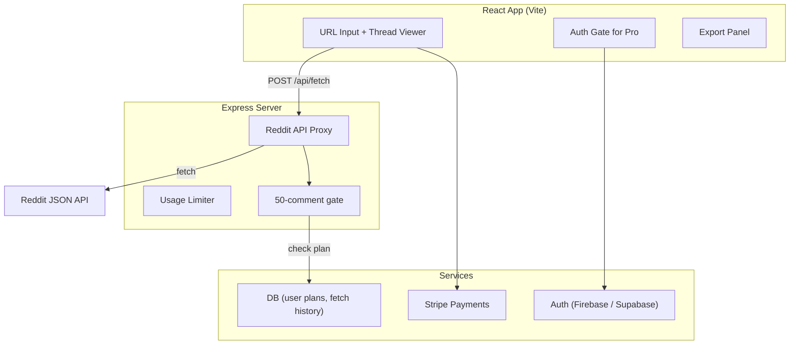

# reddit-dl — Product Requirements Document

## 1. Vision

Turn reddit-dl from a CLI hobby project into a **freemium SaaS** that lets anyone paste a Reddit URL and instantly get a clean, formatted thread (post + all comments) in Markdown, JSON, or plain text — optimized for feeding into AI tools (ChatGPT, Claude, Cursor, etc.).

---

## 2. Sustainability Analysis

### 2.1 Unit Economics — Cost Per Request

| Cost Item | Per fetch | Notes |
|---|---|---|
| Reddit API (initial post+comments) | ~$0.00024 | 1 request × $0.24/1K |
| Reddit API ("more comments" batches) | ~$0.00072–0.0024 | 3–10 extra requests for threads >50 comments |
| Proxy server compute (VPS) | ~$0.000005 | Negligible at low volume |
| **Total cost per thread fetch** | **~$0.001–$0.003** | Even heavy threads < $0.01 |

> [!TIP]
> At $0.003 worst-case cost per fetch, a $5/mo subscriber fetching **50 threads/month** yields **$4.85 gross profit per user**. Even at 200 fetches/month you're at $4.40 profit.

### 2.2 Revenue Projections

| Scenario | Paying Users | MRR | Annual | Monthly COGS | Gross Margin |
|---|---|---|---|---|---|
| Bootstrap (Month 3) | 20 | $100 | $1,200 | ~$15 | 85% |
| Traction (Month 6) | 100 | $500 | $6,000 | ~$50 | 90% |
| Growth (Month 12) | 500 | $2,500 | $30,000 | ~$200 | 92% |

Fixed costs: ~$10-30/mo VPS (Hetzner/Railway), ~$0 Reddit API (free tier covers 10K requests/mo, then $0.24/1K).

### 2.3 Free Tier Limits & Why ≤50 Comments Works

- **~80%+ of Reddit posts have ≤50 comments** (median is ~9 comments)
- Viral/high-value threads (100–5000+ comments) are 10-20% of posts but the ones people *most want*
- This means: **most casual use is free → builds trust → paywalls the power users who get real value**

### 2.4 Competitive Landscape

| Competitor | Price | Differentiator | Weakness |
|---|---|---|---|
| ExportComments.com | Free 100 comments, paid unlimited | Simple web UI | CSV only, no AI-friendly formats |
| Apify Reddit Scraper | $15+/mo | Powerful, programmable | Dev-focused, complex, expensive |
| Cobalt Tools | Free | Open-source, multi-platform | Media only, not text/comments |
| Manual copy-paste | Free | No tool needed | Loses formatting, nesting, metadata |
| **reddit-dl (us)** | **Free ≤50, $5/mo** | **AI-optimized formats, instant, cheap** | **New, no brand yet** |

> [!IMPORTANT]
> **Our moat**: No existing tool outputs Reddit threads in AI-ready formats (structured Markdown with metadata, clean JSON, token-counted text). We're positioned at the intersection of **Reddit data** + **AI workflow tooling** — a growing niche.

---

## 3. Target Users

| Persona | Use Case | Willingness to pay |
|---|---|---|
| **AI Developers** | Feed Reddit context into LLMs for RAG, fine-tuning | High — save hours |
| **Content Creators** | Research viral topics, summarize discussions | Medium |
| **Researchers** | Sentiment analysis, discourse mining | Medium-High |
| **Marketers** | Competitor analysis, market research from subreddits | High |
| **Power Redditors** | Archive/backup threads, offline reading | Low-Medium |

---

## 4. Feature Specification

### 4.1 Free Tier (no signup required)
- Fetch any Reddit thread
- View post + up to **50 comments** (including nested replies)
- Export as Markdown / JSON / Plain Text
- Copy to clipboard
- Client-side filters (min score, max depth, OP-only, skip deleted)

### 4.2 Pro Tier — $5/month
- **All comments** (no 50-comment cap — threads with 500-5000+ comments)
- **Bulk download** — queue multiple threads
- **Export history** — last 30 days of fetched threads saved to account
- **Priority fetching** — faster API queue, no rate limiting delays
- **API access** — personal API key for programmatic use
- Token count display (useful for AI context window planning)

### 4.3 Future Considerations (v2+)
- Subreddit-level download (all posts from r/xyz)
- Scheduled monitoring (new threads in a subreddit → auto-export)
- Team/org plans at $15/mo
- Webhook integrations (Notion, Slack, Zapier)

---

## 5. Technical Architecture



### Key Implementation Notes

| Decision | Choice | Rationale |
|---|---|---|
| Auth | Firebase Auth (Google + email) | You already use Firebase for Life II |
| Payments | Stripe Checkout + Billing Portal | Industry standard, handles SCA/invoices |
| Comment gate | Server-side truncation | Free users get `comments.slice(0, 50)` from the API response |
| Database | Firestore | Familiar stack, stores user plan + fetch history |
| Hosting | Vercel (frontend) + Railway (API) | Cheap, auto-scaling |

---

## 6. Pricing Page Copy

```
🆓 Free              →  50 comments per thread, unlimited threads
⚡ Pro — $5/month    →  All comments, bulk download, export history, API access
```

---

## 7. Risks & Mitigations

| Risk | Impact | Mitigation |
|---|---|---|
| Reddit blocks API access | Fatal | Use .json URL trick (current approach, no auth needed); fallback to scraping |
| Reddit changes API pricing | High | Current approach uses unauthenticated `.json` endpoints (free); migrate to authenticated only if forced |
| Low conversion rate | Medium | Generous free tier builds habit; paywall only the high-value threads |
| Competitors copy the idea | Medium | Move fast, build brand, add AI-specific features (summarization, Q&A over thread) |

> [!NOTE]
> **Current approach uses Reddit's public `.json` endpoint** (appending `.json` to any post URL), which does **not** require API keys or OAuth. This means **zero API cost** today. Reddit could restrict this in the future, but it has been stable for years.

---

## 8. Launch Plan

| Phase | Timeline | Goal |
|---|---|---|
| **Alpha** (current) | Now | Working web app, free for all |
| **Beta** | +2 weeks | Add auth + Stripe, enforce 50-comment limit for free users |
| **Launch** | +4 weeks | Post on Product Hunt, r/SideProject, Hacker News |
| **Growth** | +2-3 months | SEO blog posts ("how to feed Reddit to ChatGPT"), Twitter/X threads |

---

## 9. Verdict: Is $5/mo Sustainable?

> [!IMPORTANT]
> ### ✅ Yes — this is a sustainable model.
>
> - **COGS is near-zero** (~$0.003/fetch using free `.json` endpoints)
> - **Gross margin is 85-92%** even at small scale
> - **$5/mo is impulse-buy pricing** — low friction to convert
> - **50-comment free tier** covers 80%+ of posts → generous enough for trust, tight enough for conversion
> - **Break-even**: ~5-10 paying users covers a $30/mo VPS
> - **Main risk** isn't cost — it's **distribution** (getting people to find the tool)
>
> Focus energy on distribution (SEO, Reddit marketing, AI community presence), not on reducing costs.
